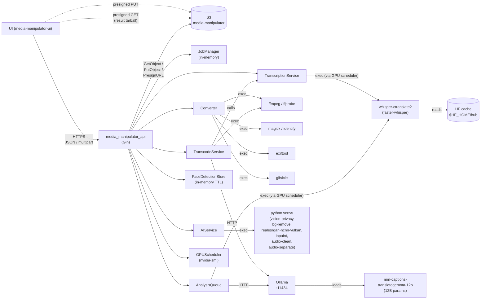
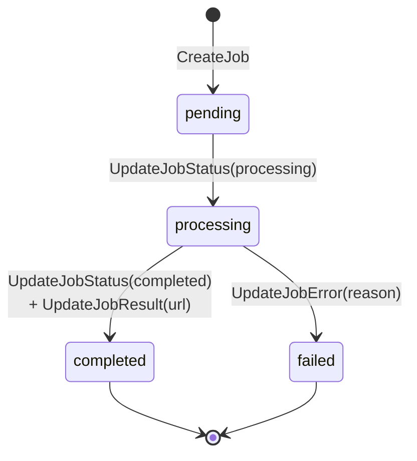
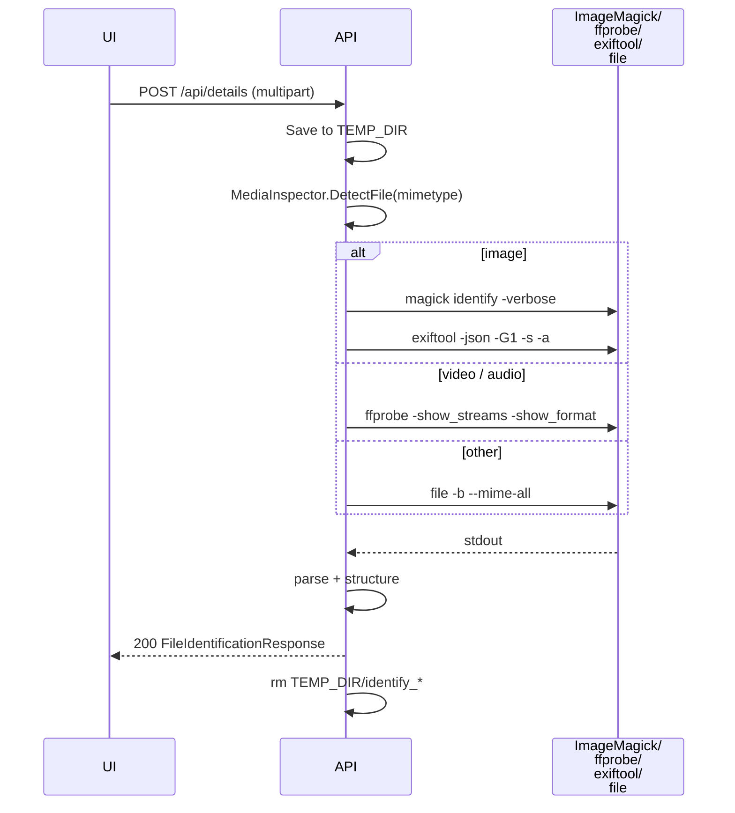
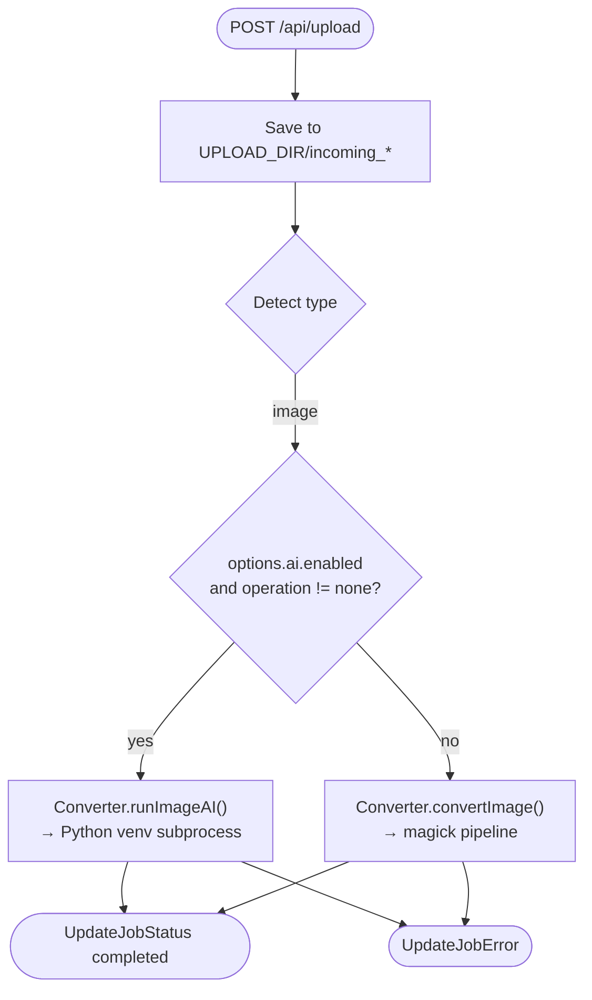
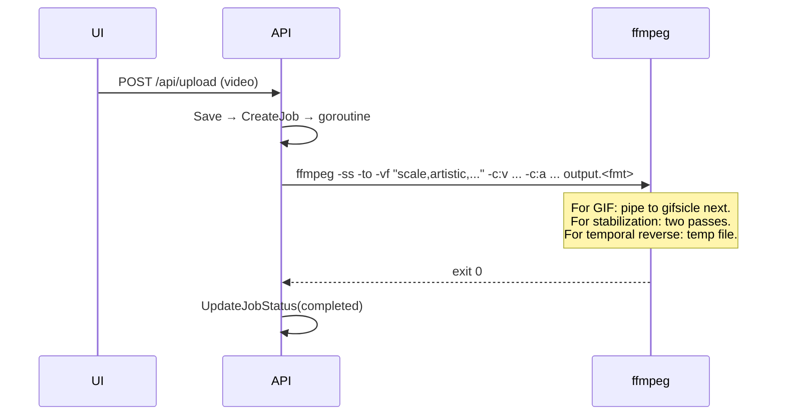
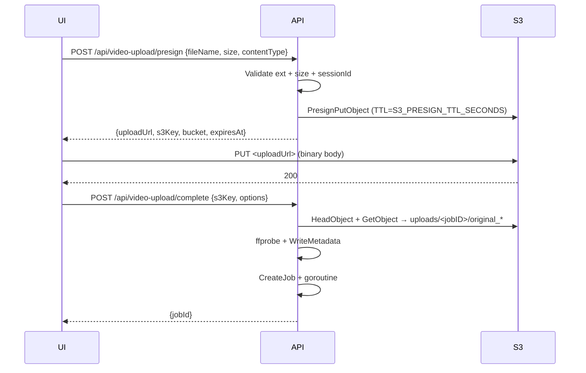
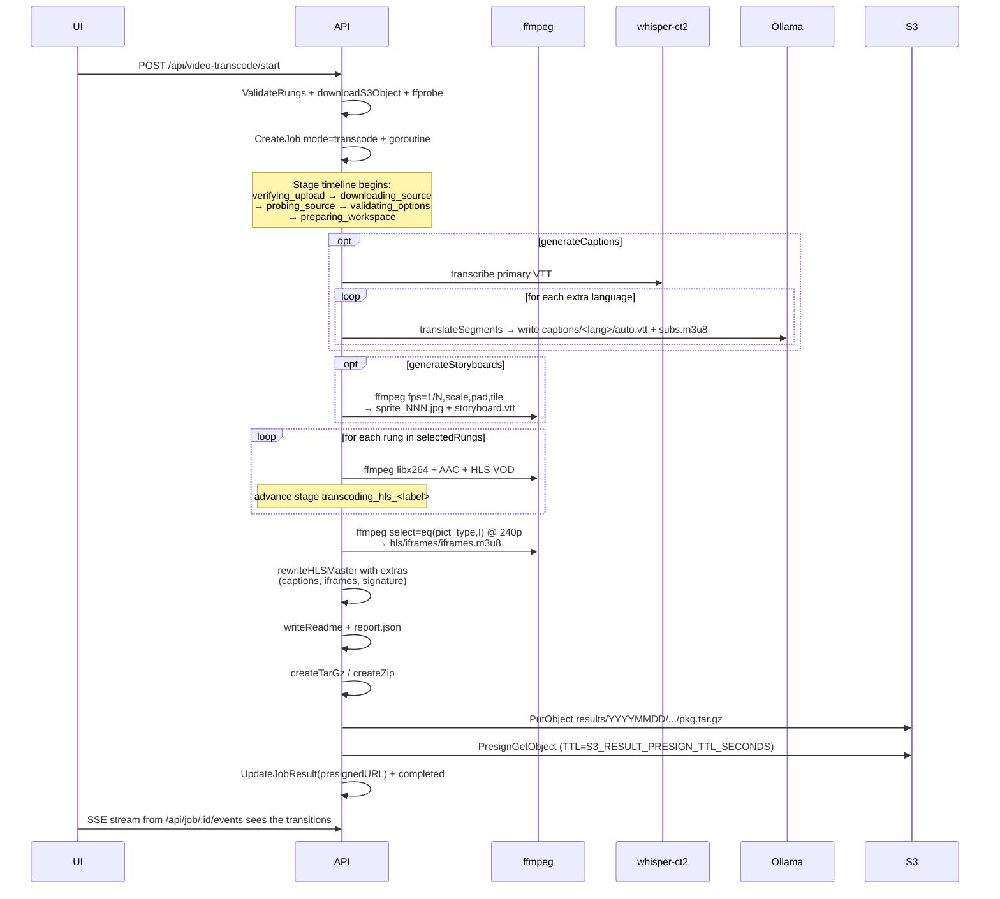
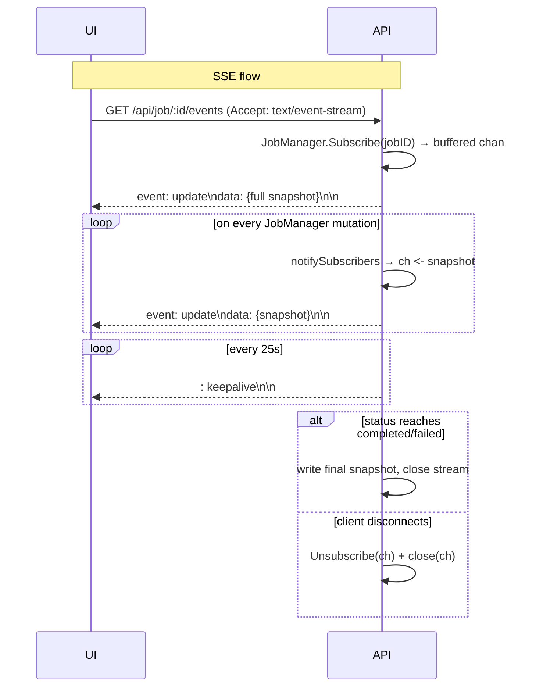
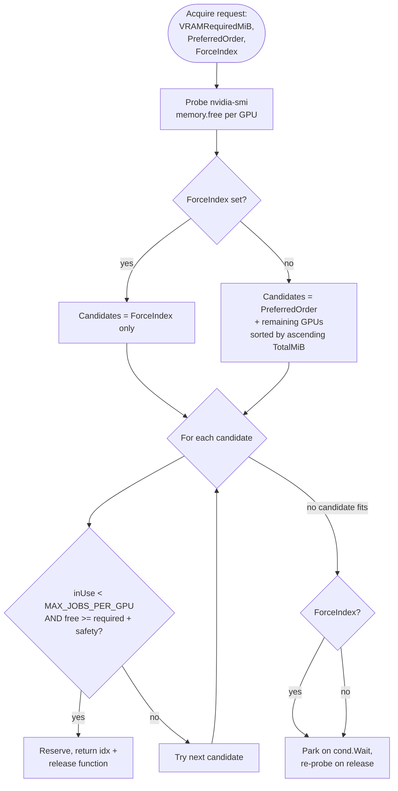

# Media Manipulator API — Runbook

Operator and on-call reference for the `media_manipulator_api` Go service.
Optimized for "something broke, what do I check?" — happy paths are described
briefly so you can compare against them, but the meat is failure modes and
debug commands.

> **Owner:** CreaTV Ltd. — single-host deployment on a Linux server with two
> NVIDIA GPUs (RTX 5060 Ti at index 0, RTX 5080 at index 1) and a local
> Ollama install. Repo:
> `Website/Frontend/media_manipulator/media_manipulator_api/`.

---

## Table of contents

1. [Service overview](#1-service-overview)
2. [Architecture diagram](#2-architecture-diagram)
3. [Quick smoke tests](#3-quick-smoke-tests)
4. [Environment variables](#4-environment-variables)
5. [HTTP API surface](#5-http-api-surface)
6. [Job lifecycle](#6-job-lifecycle)
7. [Feature playbooks](#7-feature-playbooks)
   - [7.1 File identify](#71-file-identify)
   - [7.2 Image conversion (+ AI ops)](#72-image-conversion--ai-ops)
   - [7.3 Face detection preview](#73-face-detection-preview)
   - [7.4 Audio conversion (+ AI ops)](#74-audio-conversion--ai-ops)
   - [7.5 Video conversion](#75-video-conversion)
   - [7.6 Direct-to-S3 video upload](#76-direct-to-s3-video-upload)
   - [7.7 Transcription](#77-transcription)
   - [7.8 Transcode to HLS](#78-transcode-to-hls)
   - [7.9 Transcode to DASH](#79-transcode-to-dash)
   - [7.10 Job status + SSE event stream](#710-job-status--sse-event-stream)
   - [7.11 Result download](#711-result-download)
8. [GPU scheduling](#8-gpu-scheduling)
9. [External dependencies](#9-external-dependencies)
10. [Common incidents and recovery](#10-common-incidents-and-recovery)
11. [Logging conventions](#11-logging-conventions)
12. [Command appendix](#12-command-appendix)

---

## 1. Service overview

`media_manipulator_api` is a stateless-ish Go + Gin HTTP API that fronts a
set of local media-processing pipelines:

- **Conversion** (image / video / audio) via FFmpeg, ImageMagick, gifsicle.
- **AI image ops** — face privacy, background removal, super-resolution,
  text-PII redaction, object removal — via local Python venvs/scripts on a
  GPU.
- **AI audio ops** — vocal isolation/removal, noise cleanup — via Demucs and
  DeepFilter.
- **Identification + metadata** via ImageMagick `identify`, ExifTool, and
  FFprobe.
- **Transcription** via `whisper-ctranslate2` (faster-whisper) on CUDA.
- **Adaptive streaming transcode** — HLS (H.264/AAC) and DASH (AV1 or VP9)
  packages with optional multilingual captions, sprite-sheet storyboards,
  and an I-frame playlist for scrubbing.
- **Caption translation** via a local Ollama model
  (`mm-captions-translategemma-12b`).

Job state is **in-memory only** (the `JobManager` map). Restarting the
process loses all in-flight jobs. Source uploads land on S3; transcode
results are uploaded back to S3 under a separate `results/` prefix and
returned to the client as presigned GET URLs.

The API speaks JSON over HTTPS, with one SSE endpoint at
`GET /api/job/:jobId/events` for live progress.

---

## 2. Architecture diagram



**Process model:** single Go binary, single Gin server, multiple goroutines.
Long-running jobs run in their own goroutines fired off from the relevant
handler.

**State boundaries:**
- *In-memory*: `JobManager`, `FaceDetectionStore`, the `GPUScheduler`'s
  reservation map, the SSE subscribers map.
- *Filesystem*: `UPLOAD_DIR`, `OUTPUT_DIR`, `TEMP_DIR` (per-job
  subdirectories under each).
- *S3*: source uploads under `videos/YYYYMMDD/<sessionID>/<uuid>.<ext>`;
  transcode results under `results/YYYYMMDD/<sessionID>/<jobID>/<pkg>.tar.gz`
  (or `.zip`).
- *External services*: Ollama on localhost, S3 in us-west-2.

---

## 3. Quick smoke tests

After a deploy / restart, run these in order. They each take ~1 s.

```bash
# Process is up
curl -sS http://localhost:59997/healthz | jq .
# expect: {"status":"healthy","service":"media_manipulator_api"}

# API namespace health
curl -sS http://localhost:59997/api/health | jq .

# Transcode capabilities (confirms ffmpeg/ffprobe/encoders/Ollama reachability)
curl -sS http://localhost:59997/api/video-transcode/capabilities | jq .
```

Then watch the API log for any of these one-time-at-startup lines (search by
prefix):

| Prefix | What it tells you |
| --- | --- |
| `media-manipulator-api listening on :…` | server bound to its port |
| `gpu-scheduler: enabled with N GPUs [...]` | nvidia-smi reachable, GPU inventory |
| `gpu-scheduler: disabled — nvidia-smi unavailable …` | CPU-only mode, GPU pre-flight is a no-op |
| `whisper-ct2: model cache HF_HOME="…"` | first time whisper is invoked; cache wired |
| `whisper-ct2: WARNING — neither HF_HOME nor …` | cache wiring is broken, whisper will fail |
| `whisper-ct2: GPU auto-selected …` *(legacy — should no longer appear in current build)* | obsolete; if you see it your binary is stale |

---

## 4. Environment variables

All vars below are read at process start (via `internal/config/config.go`)
or lazily on first use (the AI/whisper/Ollama paths). Restart the process
after changing them.

### 4.1 Server / runtime

| Var | Default | Effect | Read by |
| --- | --- | --- | --- |
| `UPLOAD_DIR` | `uploads` | Where multipart uploads land before processing. | `config.go` |
| `OUTPUT_DIR` | `outputs` | Where per-job output artifacts live. | `config.go` |
| `TEMP_DIR` | `temp` | Scratch directory for short-lived files (probes, etc). | `config.go` |
| `MAX_FILE_SIZE_BYTES` | `1073741824` (1 GiB) | Hard cap on multipart uploads to `/api/upload`. | `config.go` |
| `MAX_VIDEO_UPLOAD_SIZE_BYTES` | matches `MAX_FILE_SIZE_BYTES` | Hard cap on direct-to-S3 video uploads. Independent so you can let videos be bigger. | `config.go` |
| `COMMAND_TIMEOUT_SECONDS` | `21600` (6 h) | Per-command timeout passed to FFmpeg/ImageMagick/etc. via `context.WithTimeout`. | `config.go` |
| `ANALYSIS_WORKERS` | `1` | Concurrent goroutines draining the analysis (Ollama) queue. | `config.go` |
| `AI_ENABLED` | `true` | Master switch — when `false`, the `AIService` is not built and AI ops fail with "AI service is not enabled". | `config.go` |
| `PROD` | `false` | Legacy flag that used to pin whisper to GPU 0. Now mostly inert; the GPU scheduler is the source of truth. | `transcribe.go` |

### 4.2 S3

| Var | Default | Effect |
| --- | --- | --- |
| `AWS_REGION` | `us-west-2` | Region for the S3 client. |
| `AWS_ACCESS_KEY_ID` / `AWS_SECRET_ACCESS_KEY` / `AWS_SESSION_TOKEN` | (env-only) | Standard AWS SDK credential chain. Prefer IAM role on EC2; env vars only for local dev. |
| `AWS_S3_ENDPOINT` | `""` | If set, overrides the S3 endpoint URL (used for tests/MinIO). |
| `S3_BUCKET` | `media-manipulator` | Bucket for both uploads and results. |
| `S3_PRESIGN_TTL_SECONDS` | `900` (15 min) | Lifetime of the presigned PUT URL handed back from `/video-upload/presign`. |
| `S3_RESULT_PRESIGN_TTL_SECONDS` | `1800` (30 min) | Lifetime of the presigned GET URL handed back when a transcode finishes. |
| `S3_RESULT_PREFIX` | `results` | Key prefix for transcode result tarballs. |

### 4.3 Whisper / transcription

| Var | Default | Effect |
| --- | --- | --- |
| `WHISPER_CT2_BIN` | `/opt/creatv/whisper-ct2/bin/whisper-ctranslate2` | Path to the binary. If the path doesn't exist, the resolver falls back to the default constant, then `$PATH`. |
| `WHISPER_CT2_MODEL` | `medium` (transcribe.go) / `large-v3` (analysis_queue.go) | Whisper model name to load. |
| `WHISPER_CT2_DEVICE` | `cuda` | `cuda` or `cpu`. |
| `WHISPER_CT2_DEVICE_INDEX` | unset | **Preference list** (comma-separated allowed, e.g. `"0"` or `"0,1"`). Scheduler falls through on capacity. |
| `WHISPER_CT2_FORCE_DEVICE_INDEX` | unset | Hard pin — waits for the specific GPU even if it's full, never falls back. |
| `WHISPER_DISABLE_GPU_AUTOSELECT` | `false` | Skips nvidia-smi probing for device choice (legacy escape). |
| `WHISPER_CT2_COMPUTE_TYPE` | `float16` | `float16`, `float32`, `int8`, `int8_float16`. Drives VRAM estimate too. |
| `WHISPER_CT2_VAD_FILTER` | `true` | Enable voice-activity-detection trimming. |
| `WHISPER_CT2_BATCHED` | `false` (transcribe.go) / `true` (analysis_queue.go) | Enable batched inference. |
| `WHISPER_CT2_BATCH_SIZE` | `8` | Batch size when batched mode is on. |
| `WHISPER_CT2_LANGUAGE` | unset (auto-detect) | BCP-47 language hint. |
| `WHISPER_CT2_OUTPUT_DIR` | `/tmp/ct2_out` | Scratch dir for whisper's JSON output. |
| `WHISPER_GPU_CONCURRENCY` | `1` | Process-wide semaphore on concurrent whisper invocations. Bump to your GPU count for true multi-GPU parallel. |
| `WHISPER_HF_CACHE_DIR` | unset → falls back to `HF_HOME` | Explicit `HF_HOME` override applied to the subprocess. Use this when systemd doesn't carry your shell's `HF_HOME`. |
| `HF_HOME` | unset | HuggingFace cache root. Models live under `$HF_HOME/hub/`. |
| `WHISPER_ALLOW_HF_NETWORK` | `false` | Default is offline (`HF_HUB_OFFLINE=1`, `TRANSFORMERS_OFFLINE=1`). Set to `true` only when downloading a new model. |
| `GPU_SCHED_MAX_JOBS_PER_GPU` | `1` | Per-GPU concurrent job cap. |
| `GPU_SCHED_SAFETY_MARGIN_MIB` | `512` | Required-free padding on top of the VRAM estimate. |

### 4.4 Ollama (analysis + caption translation)

| Var | Default | Effect |
| --- | --- | --- |
| `OLLAMA_URL` | `http://localhost:11434` | Base URL of the Ollama HTTP API. |
| `OLLAMA_TIMEOUT_SECONDS` | `300` | Per-request timeout for chat completions. |
| `OLLAMA_VLM_MODEL` | `qwen3-vl:8b-instruct-q8_0` | Vision-language model used by the transcript analyzer (`analysis_queue.go`). |
| `OLLAMA_TEXT_MODEL` | falls back to `OLLAMA_VLM_MODEL` | Text-only model for transcript summary/safety review. |
| `OLLAMA_CAPTIONS_MODEL` | `mm-captions-translategemma-12b` | Translation model invoked for additional caption tracks. |
| `OLLAMA_VLM_FRAME_INTERVAL_SECONDS` | `10` | When analyzing silent video, sample one frame every N seconds. |
| `OLLAMA_VLM_MAX_WIDTH` | `768` | Max width of frames sent to the VLM. |
| `OLLAMA_VLM_MAX_FRAMES` | `24` | Max frames per analysis batch. |
| `OLLAMA_VLM_BATCH_SIZE` | `4` | Inner batch size when calling the VLM. |

### 4.5 AI image / audio toolchain

| Var | Default | Effect |
| --- | --- | --- |
| `AI_ROOT_DIR` | `/opt/media-manipulator-ai` | Root of every Python venv / script / model directory below. |
| `AI_CUDA_GPU` | `1` | CUDA device index passed to the Python AI scripts. Should be the RTX 5080. |
| `AI_VULKAN_GPU` | `1` | GPU index for Vulkan-based realesrgan-ncnn. |
| `AI_DEEPFILTER_BIN` | `${AI_ROOT_DIR}/venvs/audio-clean/bin/deepFilter` | DeepFilterNet (audio denoise). |
| `AI_DEMUCS_BIN` | `${AI_ROOT_DIR}/venvs/audio-separate/bin/demucs` | Demucs (vocals isolate/remove). |
| `AI_VISION_PYTHON` | `${AI_ROOT_DIR}/venvs/vision-privacy/bin/python` | Python that runs face_privacy and text-PII scripts. |
| `AI_FACE_PRIVACY_SCRIPT` | `${AI_ROOT_DIR}/scripts/face_privacy.py` | Path to the runtime script (a reference copy lives at `scripts/server/face_privacy.py` in the repo). |
| `AI_TEXT_REDACT_SCRIPT` | `${AI_ROOT_DIR}/scripts/redact_text_pii.py` | OCR-based text redaction script. |
| `AI_REMBG_BIN` | `${AI_ROOT_DIR}/venvs/bg-remove/bin/rembg` | rembg CLI for background removal. |
| `AI_REMBG_ENV_SCRIPT` | `${AI_ROOT_DIR}/env/onnxruntime-cuda-bg-remove.sh` | Shell script that exports CUDA paths for rembg. |
| `AI_REMBG_MODEL_DIR` | `${AI_ROOT_DIR}/models/rembg` | rembg model cache. |
| `AI_REALESRGAN_BIN` | `${AI_ROOT_DIR}/bin/realesrgan-ncnn-vulkan/realesrgan-ncnn-vulkan` | RealESRGAN Vulkan binary. |
| `AI_VULKAN_ENV_SCRIPT` | `${AI_ROOT_DIR}/env/vulkan-nvidia.sh` | Shell script that exports Vulkan paths. |
| `AI_LAMA_PYTHON` | `${AI_ROOT_DIR}/venvs/inpaint/bin/python` | Python for simple_lama_inpainting (object removal). |
| `AI_REMOVE_OBJECT_SCRIPT` | `${AI_ROOT_DIR}/scripts/remove_object_lama.py` | The runtime path for the object-removal script. |

> **Note on the AI scripts:** the reference copies in
> `scripts/server/*.py` are checked into the repo so updates are reviewable.
> The runtime path on the server is set by the env vars above and is
> conventionally `/opt/media-manipulator-ai/scripts/*.py`. Deploy with
> `sudo cp scripts/server/<script>.py /opt/media-manipulator-ai/scripts/`.

---

## 5. HTTP API surface

All routes live under `/api/` except `/healthz`.

| Method | Path | Purpose | Long-running? |
| --- | --- | --- | --- |
| GET | `/healthz` | Process liveness. | No |
| GET | `/api/health` | Same, namespaced under `/api`. | No |
| POST | `/api/details` | Identify a file + extract metadata (no job created). | No (sync, bounded by `COMMAND_TIMEOUT_SECONDS`) |
| POST | `/api/upload` | Multipart upload + conversion. Returns `{jobId}`. | Yes (goroutine) |
| POST | `/api/video-upload/presign` | Presigned S3 PUT URL for the UI to upload a video directly. | No |
| POST | `/api/video-upload/complete` | Tells the API "the S3 upload finished, do something with it". Used by the convert/transcribe flows. | Yes |
| POST | `/api/ai/faces/detect` | Detect faces and store the boxes for the next conversion. | No |
| POST | `/api/video-transcode/probe` | ffprobe an uploaded S3 video and return the rung selector data. | No |
| POST | `/api/video-transcode/start` | Kick off an HLS or DASH transcode job against an S3 key. Returns `{jobId, probe, selectedRungs}`. | Yes |
| GET | `/api/video-transcode/capabilities` | Report ffmpeg encoder availability + Ollama reachability + caption language catalog. | No |
| GET | `/api/job/:jobId` | Poll a job's full JSON state. | No |
| GET | `/api/job/:jobId/events` | SSE event stream of job state changes. Closes on completed/failed. | Yes (open connection) |
| GET | `/api/download/:jobId` | Stream the converted output file for jobs that produced one locally (image/audio/video convert + transcribe). | No |
| GET | `/api/transcript/:jobId` | Serve the `transcribe_result.json` for a transcribe job. | No |
| GET | `/api/analysis/:jobId` | Serve the `analysis.json` (transcript summary + safety review) for a transcribe job. | No |

**CORS** allow-list (in `cmd/api/main.go`): `https://media-manipulator.com`,
`https://www.media-manipulator.com`, `http://localhost:5175`. Add origins
there if you ever serve a staging UI from elsewhere.

---

## 6. Job lifecycle

Every job is a `*models.ConversionJob` in `JobManager.jobs[id]`. The state
machine is the same for every workflow; what differs is which `Mode` it
runs in.



### 6.1 Fields populated over time

| Field | When populated | Notes |
| --- | --- | --- |
| `id` | At `CreateJob`. | UUIDv4. |
| `status` | At every status transition. | `pending → processing → completed\|failed`. |
| `progress` | Throughout. | 0–100, `100` only on completed. |
| `originalFile` | At `CreateJob`. | `{name, size, type}`. |
| `options` | At `CreateJob`. | Echoed back to the UI; for transcode jobs includes `mode=transcode`, `protocol`, `dashCodec`, `qualityRungs`, `bundleFormat`, etc. |
| `mode` | Set by handlers. | `"transcode"` for video-transcode jobs; empty otherwise. |
| `currentStage` | Updated by `JobManager.ReplaceStages`. | Most recent stage key (transcode jobs only). |
| `stages[]` | Updated by `JobManager.ReplaceStages`. | Per-stage `{key,label,status,progress,qualityLabel,message}` (transcode jobs only). |
| `transcodeReport` | Set by `SetTranscodeReport` after ffprobe. | Full `VideoProbeResponse`. |
| `resultUrl` | On completion. | For local-result jobs: `/api/download/<jobId>`. For transcode jobs: presigned S3 GET URL. |
| `resultS3Key`, `resultFileName`, `expiresAt` | On transcode completion. | Set by `SetResultMetadata`. |
| `error` | On failure. | Free-form string (often wraps the stderr tail from a subprocess). |

### 6.2 Notification fan-out

After every mutating method (`UpdateJobStatus`, `UpdateJobProgress`,
`UpdateJobResult`, `UpdateJobError`, `SetMode`, `ReplaceStages`,
`SetTranscodeReport`, `SetResultMetadata`), `JobManager.notifySubscribers`
snapshots the job and non-blocking-sends to every subscriber channel. The
SSE handler at `/api/job/:jobId/events` is the only consumer today.

---

## 7. Feature playbooks

### 7.1 File identify

`POST /api/details` — sync. Detects type, runs the right probe tool, returns
a structured response.



**Happy path:** sub-second for images, 1–5 s for video depending on file
size and disk.

**Failure modes:**

| Symptom | Likely cause | Check |
| --- | --- | --- |
| `Failed to identify file` (500) | `magick` or `ffprobe` not on PATH; or file is corrupt. | `which magick ffprobe exiftool file` |
| Returns `fileType: unknown` | mimetype probe failed and file extension is unrecognized. | Look at `details.file_command_output` in the response. |
| `probe_error` key present in response | Identify ran but its parser hiccupped; raw output is in `rawOutput`. | Use `rawOutput` to debug what the probe actually printed. |

---

### 7.2 Image conversion (+ AI ops)

`POST /api/upload` with `options.format` set to a supported image format
(jpg / png / webp / gif). When `options.ai.enabled` is true and
`options.ai.operation` is non-empty, the AI path runs *instead of* the
normal ImageMagick pipeline.

**AI image ops** (constants in `internal/services/ai_tools.go`):

- `face_privacy` — blur/redact faces. Honors `faceMode` + `faceSelection`.
  Falls back to "all faces" if no selection was uploaded.
- `remove_background` — rembg (ONNXRuntime). Output is forced to PNG.
- `ai_upscale` — RealESRGAN Vulkan. Output forced to PNG.
- `redact_text` — Tesseract OCR + ImageMagick masking.
- `remove_object` — simple_lama_inpainting given user-drawn rectangles.



**Happy path output**: written to
`outputs/<jobID>/converted.<ext>` (or `<ext>` forced by AI op).

**Failure modes:**

| Symptom | Likely cause | Check |
| --- | --- | --- |
| `AI service is not enabled` | `AI_ENABLED=false` in env. | `env | grep AI_ENABLED` |
| `face_privacy: face detection session not found` | UI sent `faceSelection.sessionId` but the session expired (default TTL 30 min) or never existed. | UI should retry detect first. |
| `face_privacy: image SHA mismatch` | User changed the image between detect and convert. | Expected — UI should re-detect. |
| `realesrgan-ncnn-vulkan: ...` errors | Vulkan driver missing or env script not sourced. | `$AI_VULKAN_ENV_SCRIPT` exports + `vulkaninfo` should work. |
| `rembg: ...` errors with `onnxruntime` mentions | CUDA/cuDNN mismatch for ONNXRuntime. | Re-source `$AI_REMBG_ENV_SCRIPT`. |
| Job silently uses ImageMagick when you expected AI | `options.ai.enabled` was false or `operation` was `"none"`. | Inspect the job's `options` in `GET /api/job/:id`. |

---

### 7.3 Face detection preview

`POST /api/ai/faces/detect` — runs the `face_privacy` script in
`--detect-only` mode, returns face boxes, and stashes them in
`FaceDetectionStore` keyed by a session ID. The UI uses the session ID +
the user's selection on the eventual convert request.

**Important properties of the store:**

- In-process, in-memory map. Restart loses everything.
- TTL is hard-coded at 30 minutes via `NewFaceDetectionStore(30 * time.Minute)`
  in `cmd/api/main.go`.
- Stores **metadata only** — never the uploaded image bytes. The SHA256 of
  the uploaded image is recorded so the convert request can validate the
  user didn't swap images mid-flow.

**Failure modes:**

| Symptom | Cause | Recovery |
| --- | --- | --- |
| `Face detection only supports image files` (400) | UI sent a video or audio. | Client bug. |
| `Face detection failed` (500) | `face_privacy.py` exited non-zero. | `tail $OUTPUT_DIR/<jobID>/...` and check the GPU/Vulkan env. |
| `Face detection store is not configured` | `cmd/api/main.go` didn't construct the store. Should not happen in current build. | Code bug. |

---

### 7.4 Audio conversion (+ AI ops)

`POST /api/upload` with `options.format` ∈ `{mp3, wav, aac, ogg, flac, alac,
opus, ac3, dts}`. AI audio operations (in `ai_tools.go`):

- `remove_background_noise` → DeepFilterNet (`$AI_DEEPFILTER_BIN`).
- `isolate_vocals` → Demucs, keep `vocals.wav` stem.
- `remove_vocals` → Demucs, sum all non-vocal stems.

**Failure modes specific to audio AI:**

| Symptom | Cause | Check |
| --- | --- | --- |
| `demucs: model download failed` | First-ever run without network OR HF rate-limited. | Pre-download once with the bin manually so the model lands in `~/.cache/torch`. |
| `deepFilter: not found` | Path doesn't exist or venv is broken. | `$AI_DEEPFILTER_BIN --help`. |
| Output is silent for `isolate_vocals` | The source had no vocals to begin with. | Expected; not an error. |

---

### 7.5 Video conversion

`POST /api/upload` *or* the S3 flow (see 7.6) with
`options.format` ∈ `{mp4, webm, avi, mov, mkv, flv, wmv, prores, dnxhd,
gif}`.

Special cases inside `Converter.convertVideo`:

- `format=gif` runs an FFmpeg → gifsicle pipeline (`options.gif`).
- `options.trim` cuts using `-ss` + `-to` before any other filter.
- `options.visualEffects.artistic` triggers FFmpeg filtergraph variants
  (oil-painting, sketch, emboss, edge-detection, posterize, watercolor,
  vintage, etc.).
- `options.temporal.reverse` and `pingPong` need a temporary file because
  `reverse` requires loading the stream end-to-end.
- `options.advanced.stabilization` runs a two-pass FFmpeg (vidstabdetect →
  vidstabtransform).



**Failure modes:**

| Symptom | Cause | Recovery |
| --- | --- | --- |
| `ffmpeg: Error opening filtergraph` | Unsupported combo of effects on this FFmpeg build. | Reduce options; check FFmpeg version with `ffmpeg -filters`. |
| `Conversion timed out` | Video longer than `COMMAND_TIMEOUT_SECONDS` (default 6h). | Bump the env or shorten input. |
| Resulting MP4 won't play in Safari | `-pix_fmt yuv420p` wasn't included; or H.265 was selected without HVC1 hint. | Add `-pix_fmt yuv420p` for H.264. |
| GIF is huge | Default GIF settings produce big files; tune `gif.width`, `gif.fps`, `gif.colors`, `gif.delay`, `gif.optimize`. | See `GIFOptions` defaults: width 900, fps 12, colors 128, delay 3, optimize 3. |

---

### 7.6 Direct-to-S3 video upload

For files larger than the multipart limit, the UI uploads straight to S3
via a presigned PUT, then asks the API to take it from there.



**Key construction:** `videos/YYYYMMDD/<sessionID>/<uuid>.<ext>`. The
`sessionID` segment comes from the `X-MM-Session-ID` header (preferred) or
the request body. If neither is provided, a fresh UUID is generated.

**Key validation in `sanitizeUploadedVideoKey`** (the same logic powers both
`/video-upload/complete` and `/video-transcode/probe`):

- Must start with `videos/`.
- Must split into exactly 4 segments.
- Segments 1 + 2 must round-trip through `sanitizeS3PathSegment`.
- Final segment's extension must be in the supported video list.

**Failure modes:**

| Symptom | Cause | Recovery |
| --- | --- | --- |
| `Unsupported video file extension` on presign | `fileName` extension not in `isSupportedVideoExtension`. | Add to the allow-list or rename the file. |
| `Video exceeds maximum upload size` | `fileSizeBytes` > `MAX_VIDEO_UPLOAD_SIZE_BYTES`. | Bump the env or compress. |
| `Uploaded video was not found` on complete | The PUT to S3 failed silently or the key is wrong. | `aws s3 ls s3://$S3_BUCKET/<s3Key>`. |
| `Uploaded video is empty` | PUT succeeded but `ContentLength=0`. | Network issue mid-upload — retry. |
| `Uploaded video size does not match the requested size` | The UI lied about `fileSizeBytes`. | Client bug; verify the UI is sending real `file.size`. |
| `Invalid s3Key` | Key didn't pass `sanitizeUploadedVideoKey`. | Confirm path matches `videos/YYYYMMDD/sessionID/uuid.ext`. |
| `Failed to create upload URL` | S3 presign failed — IAM, region mismatch, or clock skew. | Check `S3:PutObject` permission + system clock + bucket region. |

---

### 7.7 Transcription

Triggered when `options.mode=="transcribe"` on `/api/upload` or
`/api/video-upload/complete`. Pipeline:

```mermaid
flowchart TD
    A([Receive job]) --> B[Probe duration<br/>+ audio metadata]
    B --> C{Has audio?}
    C -->|no| D[Write "no audio" placeholder<br/>+ schedule analysis]
    C -->|yes| E[ffmpeg extract<br/>16k mono pcm_s16le]
    E --> F[GPUScheduler.Acquire]
    F --> G[acquireWhisperPermit]
    G --> H[runWhisperCommand<br/>HF_HUB_OFFLINE=1<br/>CUDA_DEVICE_ORDER=PCI_BUS_ID]
    H --> I[Parse JSON<br/>output_dir/*.json]
    I --> J[Write outputPath<br/>vtt/txt/json]
    J --> K[Persist transcribe_result.json]
    K --> L[Enqueue AnalysisQueue<br/>Ollama summary + safety review]
    L --> M([completed])
```

**`transcribe_result.json` (in `OUTPUT_DIR/<jobID>/`)** contains the full
typed `TranscribeResult` — segments, language, duration, audio metadata,
and whether analysis was enqueued. The UI reads it via
`GET /api/transcript/:jobID`.

**`analysis.json` (same dir)** is written asynchronously by
`AnalysisQueue`. Status fetched via `GET /api/analysis/:jobID` — returns
404 until the analysis finishes.

**Failure modes:** see [§10 Common incidents](#10-common-incidents-and-recovery)
for the famous HF_HOME, GPU OOM, and binary-resolution issues. The other
ones:

| Symptom | Cause | Recovery |
| --- | --- | --- |
| `whisper-ct2: ... model="medium"` when you expected `large-v3` | `WHISPER_CT2_MODEL` env not set or set in the wrong service env. | Set `WHISPER_CT2_MODEL=large-v3` and restart. |
| Empty transcript even though audio exists | Whisper VAD trimmed everything (music, silence, very faint speech). | Set `WHISPER_CT2_VAD_FILTER=false` and retry. |
| Wrong language detected | Auto-detect failed on short clips. | Pass `options.language` (BCP-47 short code) on the API request. |

---

### 7.8 Transcode to HLS

`POST /api/video-transcode/start` with `protocol=hls`. Produces an Apple
HLS VOD package: `hls/master.m3u8` + per-rendition `index.m3u8` + .ts
segments, optional captions/storyboards/I-frame playlist, packaged as
`.tar.gz` or `.zip` and uploaded to S3.



**Stage progress map:**

| Stage | At ~progress | Skipped when |
| --- | --- | --- |
| `queued` | 0 | never |
| `verifying_upload` | 3 | never |
| `downloading_source` | 5 | never |
| `probing_source` | 7→10 | never |
| `validating_options` | 12→15 | never |
| `preparing_workspace` | 18 | never |
| `generating_captions` | 22→30 | `generateCaptions=false`, no audio, or transcription unavailable |
| `generating_storyboards` | 33→40 | `generateStoryboards=false` or ffmpeg fails |
| `transcoding_hls_<label>` | 40→85 (split across rungs) | never |
| `packaging_tarball` | 88→92 | never |
| `uploading_result` | 94→97 | never |
| `creating_download_url` | 99 | never |
| `completed` | 100 | only on success |

**Package layout (HLS):**

```
package/
├── hls/
│   ├── master.m3u8          ← signature comments, EXT-X-SESSION-DATA,
│   │                          EXT-X-MEDIA for each caption track,
│   │                          EXT-X-STREAM-INF per variant,
│   │                          EXT-X-I-FRAME-STREAM-INF
│   ├── 360p/index.m3u8 + segments/360p_*.ts
│   ├── 480p/...
│   ├── 720p/...
│   └── iframes/iframes.m3u8 + iframe_*.ts
├── captions/                 ← one dir per language
│   ├── <primary-lang>/auto.vtt + subs.m3u8
│   └── es/auto.vtt + subs.m3u8 (etc.)
├── storyboards/sprite_001.jpg + storyboard.vtt
├── report.json
└── README.txt
```

**Failure modes:**

| Symptom | Cause | Recovery |
| --- | --- | --- |
| `Invalid s3Key` (400 on /start) | The UI sent a key that doesn't match `videos/YYYYMMDD/sessionID/uuid.ext`. | Confirm the UI is rendering through the standard upload flow. |
| `Uploaded video was not found` | The S3 object expired or was deleted between probe and start. | Re-upload. |
| `360p requires a premium account` etc. | UI selected a rung outside the free allow-list. | Free is `360p, 480p, 720p` only. |
| `source video is too small for 720p` | UI ignored `selectableRungs` and submitted a rung > probe.height. | UI bug; confirm probe response was respected. |
| `This video is below the free transcode minimum of 360p…` | Source height < 360. | User-facing — show the message. |
| `captions failed: ...` in stages but job completes anyway | Captions are best-effort. The error lives in `stages[].message` and `report.json.warnings`. | Open the package and check the README. |
| `iframe playlist failed: ...` in warnings | I-frame second-pass ffmpeg invocation failed (rare). Job completes without it. | Inspect the warning; usually a transient ffmpeg parse issue. |
| `s3 upload: ...` | Result PUT failed. | Confirm IAM has `s3:PutObject` on `results/*`. |
| `presign: ...` | PresignGetObject failed. Usually clock skew or expired session token. | Confirm system clock + AWS creds. |

---

### 7.9 Transcode to DASH

Same `/api/video-transcode/start` endpoint with `protocol=dash` and
`dashCodec` ∈ `{av1, vp9}`. AV1 encoder is auto-detected from
`ffmpeg -encoders` in priority order: `av1_nvenc` → `libsvtav1` →
`libaom-av1`. VP9 uses `libvpx-vp9`.

```mermaid
flowchart LR
    A([protocol=dash]) --> B{codec}
    B -->|av1| C[probe ffmpeg -encoders]
    C --> D{av1_nvenc?}
    D -->|yes| E[encode with av1_nvenc]
    D -->|no| F{libsvtav1?}
    F -->|yes| G[encode with libsvtav1]
    F -->|no| H{libaom-av1?}
    H -->|yes| I[encode with libaom-av1]
    H -->|no| J[fail "no supported AV1 encoder"]
    B -->|vp9| K[encode with libvpx-vp9]
```

**Package layout (DASH):**

```
package/
├── dash/
│   ├── manifest.mpd          ← ProgramInformation (signature) +
│   │                          one AdaptationSet per content type
│   ├── 360p/init.mp4 + seg-NNNNN.m4s
│   ├── 480p/...
│   ├── 720p/...
│   └── audio/128k/init.mp4 + seg-NNNNN.m4s   (when source has audio)
├── captions/<lang>/auto.vtt  ← (no subs.m3u8 wrapper needed for DASH)
├── storyboards/...
├── report.json
└── README.txt
```

**Failure modes (DASH-specific):**

| Symptom | Cause | Recovery |
| --- | --- | --- |
| `no supported AV1 encoder found` | None of `av1_nvenc / libsvtav1 / libaom-av1` is in `ffmpeg -encoders`. | Rebuild FFmpeg with libsvtav1 minimum. Check `/api/video-transcode/capabilities`. |
| `dashCodec must be 'av1' or 'vp9'` | UI sent an unknown codec or empty when protocol=dash. | Default to av1 server-side; UI bug. |
| AV1 transcode is super slow | Encoder fell back to `libaom-av1` (CPU only). | Install nvenc or svt-av1. |
| `ffmpeg DASH ...` exit non-zero with `Cannot open dash` | Old ffmpeg without `-f dash` muxer. | Need ffmpeg ≥ 4.x. |

---

### 7.10 Job status + SSE event stream

Two parallel APIs for monitoring a job:

1. `GET /api/job/:jobId` — single-shot poll, returns the full
   `ConversionJob` JSON. Backwards-compatible with the old UI.
2. `GET /api/job/:jobId/events` — long-lived SSE stream. One `update` event
   per state change; one `:keepalive` comment every 25 s; stream closes
   when status reaches `completed` or `failed`.



**Failure modes:**

| Symptom | Cause | Recovery |
| --- | --- | --- |
| SSE never delivers an event but polling works | nginx/ALB buffering `text/event-stream`. | The handler already sets `X-Accel-Buffering: no`; confirm your proxy honors it (nginx `proxy_buffering off;`). |
| SSE delivers the initial snapshot then nothing | The subscriber channel filled up. Slow consumer. | UI should be fast; check for blocking work in the SSE consumer. |
| SSE closes after 60s repeatedly | Proxy idle timeout < 25s keepalive. | Bump the proxy's `proxy_read_timeout` to ≥ 60s. |
| `Job not found` (404) | The job ID doesn't exist (or the process restarted and lost the in-memory map). | `JobManager` is in-memory only — restart loses state. |

---

### 7.11 Result download

For local-result jobs (image/audio/video convert, transcribe):
`GET /api/download/:jobId` streams `OUTPUT_DIR/<jobID>/converted.<ext>` (or
`transcript.<ext>`).

For transcode jobs: don't use `/api/download/:jobId` — the
**presigned S3 GET URL** in `job.resultUrl` is the canonical download. The
`resultUrl` field returned from `GET /api/job/:id` is what the UI should
follow.

**Failure modes:**

| Symptom | Cause | Recovery |
| --- | --- | --- |
| `Converted file not found` (404) | The file was deleted from `OUTPUT_DIR` before download. | Cron retention; rerun the job. |
| Presigned URL returns 403 SignatureDoesNotMatch | Clock skew on the API host vs S3. | `timedatectl status`; sync NTP. |
| Presigned URL returns 403 AccessDenied | IAM role lacks `s3:GetObject` on `results/*`. | Add the policy. |
| Presigned URL returns 404 NoSuchKey | The tarball never made it to S3 (PutObject failed earlier). | Check the job's `stages[].message` for `uploading_result`. |

---

## 8. GPU scheduling

The `GPUScheduler` is a process-wide singleton (created on first call to
`SharedGPUScheduler()` from `internal/services/gpu_scheduler.go`). It's
specifically for **whisper-ctranslate2 subprocesses** today — Ollama is
treated as opaque and not scheduled by us (it has its own internal queue).

### 8.1 Decision flow per Acquire call



### 8.2 VRAM estimates per model

From `EstimateWhisperVRAMMiB`:

| Model | float16 | float32 | int8 | int8_float16 |
| --- | ---: | ---: | ---: | ---: |
| tiny | 900 | 1800 | 450 | 540 |
| base | 1200 | 2400 | 600 | 720 |
| small | 2200 | 4400 | 1100 | 1320 |
| medium | 3500 | 7000 | 1750 | 2100 |
| large-v* | 5500 | 11000 | 2750 | 3300 |
| unknown | 3500 | 7000 | 1750 | 2100 |

Plus a **safety margin** of `GPU_SCHED_SAFETY_MARGIN_MIB` (default 512) is
added on top before deciding a card "fits".

### 8.3 Operator knobs

| Knob | Effect |
| --- | --- |
| `WHISPER_CT2_DEVICE_INDEX=0` | "Try 5060 Ti first, fall back to 5080 if it can't fit." |
| `WHISPER_CT2_DEVICE_INDEX=0,1` | "Try 5060 Ti first, then explicitly 5080." Equivalent on this host. |
| `WHISPER_CT2_DEVICE_INDEX=1` | "Always start with the 5080." |
| `WHISPER_CT2_FORCE_DEVICE_INDEX=0` | "Wait for the 5060 Ti specifically; never use the 5080 even if free." Debug-only. |
| `GPU_SCHED_MAX_JOBS_PER_GPU=2` | Allow 2 concurrent whisper jobs per card (only safe if both fit in VRAM). |
| `GPU_SCHED_SAFETY_MARGIN_MIB=1024` | More conservative padding above the estimate. |
| `WHISPER_GPU_CONCURRENCY=2` | Process-wide cap on simultaneous whisper invocations (separate from per-GPU cap). |

### 8.4 Failure modes

| Symptom | Cause | Recovery |
| --- | --- | --- |
| `gpu-scheduler: disabled — nvidia-smi unavailable` at startup | Driver missing or `nvidia-smi` not on PATH. | Install `nvidia-utils` / load `nvidia` kernel module. CPU-only fallback (no scheduler). |
| Job is stuck in `transcoding_*` for ages | Scheduler is parked waiting for a GPU that never frees. | Check for orphaned whisper / Ollama processes hogging VRAM. `nvidia-smi`. |
| Job lands on the "wrong" GPU | `CUDA_DEVICE_ORDER` wasn't `PCI_BUS_ID`. | The scheduler forces this on the subprocess env; if you ran whisper manually outside the API, set it yourself. |
| `out of memory` from whisper-ct2 despite scheduler approval | Another non-API process allocated VRAM between the probe and the launch. | Reduce concurrency or set `GPU_SCHED_SAFETY_MARGIN_MIB` higher. |

---

## 9. External dependencies

### 9.1 Binaries on PATH (or env-configured)

| Binary | Where it's invoked | Required for | If missing |
| --- | --- | --- | --- |
| `ffmpeg` | `converter.go`, `transcribe.go`, `transcode_*.go`, `analysis_queue.go` | All video/audio conversion, transcoding, captions, storyboards, audio extraction for whisper. | Most features fail at job start. |
| `ffprobe` | `media_tools.go`, `transcode_probe.go`, `transcribe.go` | File identify, transcode probe, transcription duration probe. | Identify/probe/transcribe fail at job start. |
| `magick` (or legacy `identify`) | `converter.go`, `media_tools.go` | Image identify + conversion. | Image features fail. |
| `exiftool` | `media_tools.go` | Image metadata extraction. | Metadata block missing from identify; rest of the response still works. |
| `gifsicle` | `converter.go` | GIF compression after ffmpeg. | GIF jobs fail. |
| `file` | `media_tools.go` | Unknown-type identify fallback. | Unknown files report `file_command_output_error`. |
| `nvidia-smi` | `gpu_scheduler.go` | GPU pre-flight and queueing. | Scheduler disabled; whisper still works but without VRAM-aware selection. |
| `whisper-ctranslate2` | `transcribe.go`, `analysis_queue.go` | Transcription + caption ASR. | Transcribe / captions jobs fail. |
| `python` (multiple venvs) | `ai_tools.go` | AI image and audio ops. | Specific AI op fails; rest of the converter continues. |
| `realesrgan-ncnn-vulkan` | `ai_tools.go` | AI upscale. | Upscale op fails. |
| `rembg` | `ai_tools.go` | Background removal. | bg-remove op fails. |
| `demucs` | `ai_tools.go` | Vocals isolate/remove. | Audio AI op fails. |
| `deepFilter` | `ai_tools.go` | Audio denoise. | Noise-removal op fails. |

### 9.2 Network services

| Service | URL/endpoint | Used by | Failure mode |
| --- | --- | --- | --- |
| AWS S3 | `s3.<region>.amazonaws.com` | All video upload + transcode result upload | `s3 upload: ...` / `presign: ...` errors in job. |
| Ollama HTTP | `$OLLAMA_URL` (default `http://localhost:11434`) | Transcript analysis, caption translation | Translation skipped per-language with warning; analysis JSON not produced. |
| HuggingFace Hub | implicit via `huggingface_hub` Python lib in whisper | Whisper model download (one-time, then cached) | Locked down via `HF_HUB_OFFLINE=1`; failure means the model isn't in `$HF_HOME/hub`. |

### 9.3 Filesystem layout

```
/opt/creatv/whisper-ct2/bin/whisper-ctranslate2       ← default WHISPER_CT2_BIN
/var/lib/creatv/hf/                                    ← canonical HF_HOME
  └── hub/
      ├── models--Systran--faster-whisper-medium/
      ├── models--Systran--faster-whisper-large-v3/
      └── ...
/opt/media-manipulator-ai/                             ← AI_ROOT_DIR
  ├── bin/realesrgan-ncnn-vulkan/...
  ├── env/{onnxruntime-cuda-bg-remove,vulkan-nvidia}.sh
  ├── models/rembg/...
  ├── scripts/{face_privacy,redact_text_pii,remove_object_lama}.py
  └── venvs/
      ├── audio-clean/     ← deepfilter
      ├── audio-separate/  ← demucs
      ├── bg-remove/       ← rembg
      ├── inpaint/         ← simple_lama_inpainting
      └── vision-privacy/  ← face_privacy + redact_text_pii Python deps
```

---

## 10. Common incidents and recovery

Every entry here corresponds to a real failure mode the service has hit
during development. Order is rough frequency of "I'd expect to see this
again".

### 10.1 Whisper says "binary not found" at a path that isn't even in the code

**Error:** `whisper-ctranslate2 binary not found (/usr/local/bin/whisper-ctranslate2): exec: ...: no such file or directory`

**Cause:** `WHISPER_CT2_BIN` is set in the service's environment to a stale
path from a previous deployment.

**Fix:**
```bash
# What the running API actually sees:
sudo cat /proc/$(pgrep -f media_manipulator_api)/environ | tr '\0' '\n' | grep WHISPER
# Where it's set:
grep -rn WHISPER_CT2_BIN /etc/environment /etc/profile.d/ /etc/systemd/system ~/.bashrc ~/.zshrc ~/.profile 2>/dev/null
systemctl show <your-api>.service | grep -i Environment
```
Then either unset `WHISPER_CT2_BIN` (the default `/opt/creatv/whisper-ct2/bin/whisper-ctranslate2` will be used) or correct the path. The
resolver added in `transcribe.go:ResolveWhisperCT2Bin` already falls back to
the default if the env-var path doesn't exist — you'll see a warning at
startup like:
```
whisper-ct2: WHISPER_CT2_BIN="/usr/local/bin/whisper-ctranslate2" is not an executable file; falling back to "/opt/creatv/whisper-ct2/bin/whisper-ctranslate2". Fix or unset the env var to silence this warning.
```

### 10.2 Whisper says "HF_TOKEN not set" and exits with 100

**Error:**
```
whisper-ctranslate2 failed: exit status 100
HF_HOME(resolved)="" model="medium" device=cuda device_index=...
stderr_tail: Warning: You are sending unauthenticated requests to the HF Hub...
stdout_tail: ...
```

**Cause:** The API process can't see your `HF_HOME`. Faster-whisper falls
back to `~/.cache/huggingface`, doesn't find the model, tries to download
it from HF Hub, hits a rate limit unauthenticated, and dies.

**Fix:** Set `HF_HOME` (or `WHISPER_HF_CACHE_DIR`) in the API process's
environment. For systemd:
```ini
[Service]
Environment=HF_HOME=/var/lib/creatv/hf
```
Or use the API-only knob:
```ini
[Service]
Environment=WHISPER_HF_CACHE_DIR=/var/lib/creatv/hf
```
Restart and confirm via the startup log:
```
whisper-ct2: model cache HF_HOME="/var/lib/creatv/hf"
```
After this fix, whisper uses the local cache only (`HF_HUB_OFFLINE=1` is
forced on the subprocess). If you ever need to download a new model on a
fresh host, set `WHISPER_ALLOW_HF_NETWORK=1` temporarily.

### 10.3 Whisper picks the wrong GPU and OOMs

**Error:**
```
whisper-ctranslate2 failed: exit status 100
HF_HOME(resolved)="/var/lib/creatv/hf" model="large-v3" device=cuda device_index=0
stdout_tail: ... error: CUDA failed with error out of memory
```

**Cause:** Either no `--device_index` was passed (so CUDA picked device 0
under FASTEST_FIRST ordering), or the preferred device doesn't have enough
free VRAM for the model.

**Fix:** This is now handled by the scheduler. Confirm via startup log:
```
gpu-scheduler: enabled with 2 GPUs [0=NVIDIA GeForce RTX 5060 Ti(8151MiB total), 1=NVIDIA GeForce RTX 5080(16303MiB total)]
```
And per-job log:
```
gpu-scheduler: whisper-ct2 acquired GPU 1 (NVIDIA GeForce RTX 5080) — free=15500MiB used=803MiB total=16303MiB required=5500MiB+safety=512MiB
```
If you still see OOMs, raise `GPU_SCHED_SAFETY_MARGIN_MIB` (default 512).

### 10.4 Caption translation skipped silently

**Symptom:** Job completes successfully but the additional language tracks
aren't in the package; `report.json.warnings` shows `translation backend
(Ollama) is not reachable; additional caption languages were skipped` or
`translation to <lang> failed`.

**Cause:** Ollama is down, or the requested translation model isn't pulled.

**Fix:**
```bash
curl -sS $OLLAMA_URL/api/tags | jq '.models[].name'
# Should include mm-captions-translategemma-12b. If not:
ollama create mm-captions-translategemma-12b -f internal/ai/Modelfile.mm-captions-translategemma-12b
```

### 10.5 SSE stream never delivers progress

**Symptom:** UI shows "connecting…" forever or only the first event lands.

**Cause:** Reverse proxy is buffering `text/event-stream`. The handler
already sets `X-Accel-Buffering: no` and `Cache-Control: no-cache`, but
the proxy has to honor it.

**Fix (nginx):**
```nginx
location /api/job/ {
    proxy_pass http://upstream;
    proxy_http_version 1.1;
    proxy_buffering off;
    proxy_cache off;
    proxy_read_timeout 1h;
    proxy_set_header Connection "";
}
```

### 10.6 S3 presign returns 403 on download

**Symptom:** Presigned URL works briefly then 403s, or 403s immediately.

**Causes (in order of likelihood):**
1. **System clock skew** — AWS rejects pre-signed requests with timestamps
   too far in the future or past. Run `timedatectl status` and sync NTP.
2. **TTL elapsed** — default is 30 min (`S3_RESULT_PRESIGN_TTL_SECONDS`).
   The UI must hit the URL within that window. Re-fetch the job for a
   fresh URL.
3. **IAM** — missing `s3:GetObject` on `results/*`.

### 10.7 Transcode job stuck at `validating_options`

**Cause:** Source video doesn't fit any selected rung. The validator throws
errors like `source video is too small for 720p`.

**Fix:** Always render the rung selector from the probe response's
`selectableRungs`. Don't let users submit rungs that aren't in that list.

### 10.8 `Unsupported video file extension`

**Cause:** User uploaded `.m2ts`, `.ts`, or a video container we don't
allow-list.

**Fix:** Either add the extension to `isSupportedVideoExtension`
(`video_upload.go`) AND `detectTypeByExtension` (`media_tools.go`), or
ask the user to remux to mp4/mkv first.

### 10.9 `Job not found` after a deploy

**Cause:** `JobManager` is in-memory only. Restarts wipe everything.

**Fix:** Nothing to recover; the user has to re-run. If durability matters
later, the migration path is to back `JobManager` with Redis or BoltDB.

### 10.10 ImageMagick rejects PDF / SVG conversion

**Cause:** Default ImageMagick policy on Ubuntu/Debian blocks PDF/SVG/MVG.

**Fix:** Edit `/etc/ImageMagick-7/policy.xml` and loosen the policies for
the formats you want to allow. Default install:
```xml
<policy domain="coder" rights="none" pattern="PDF" />
```
→
```xml
<policy domain="coder" rights="read|write" pattern="PDF" />
```

---

## 11. Logging conventions

All logs go to stderr via `log.Printf`. There's no structured logger today
— greppable prefixes are the convention. Prefixes you'll see:

| Prefix | Source | What it tells you |
| --- | --- | --- |
| `media-manipulator-api listening on :…` | `cmd/api/main.go` | Server started. |
| `metadata probe failed for job <id>: …` | `conversion.go` | ffprobe/ImageMagick fall-through on `/api/upload`. Non-fatal. |
| `conversion failed for job <id>: …` | `conversion.go` | Top-level conversion error; job marked failed. |
| `transcription failed for job <id>: …` | `conversion.go` | Top-level transcription error. |
| `gpu-scheduler: …` | `gpu_scheduler.go` | GPU acquisition, queueing, release. |
| `whisper-ct2: …` | `transcribe.go` | Binary resolution, HF cache, subprocess env decisions. |
| `face detect …` | `conversion.go` | AI face detection diagnostics. |

For per-subprocess output (ffmpeg, magick, etc.), stderr is captured into
the job's error string. The full stderr is **not** logged to the API log
unless the subprocess fails — by design, so success cases stay quiet.

### Log searching

```bash
# Job-id-correlated log lines (when the message includes the job ID):
journalctl -u media_manipulator_api.service --since "10 min ago" | grep <jobID>

# All scheduler activity:
journalctl -u media_manipulator_api.service --since today | grep "gpu-scheduler:"

# All whisper-related diagnostics:
journalctl -u media_manipulator_api.service --since today | grep -E "whisper-ct2:|whisper:"
```

---

## 12. Command appendix

### 12.1 Service control (assumed systemd; adjust if different)

```bash
sudo systemctl status media_manipulator_api.service
sudo systemctl restart media_manipulator_api.service
sudo systemctl reload media_manipulator_api.service        # if you wire SIGHUP later
sudo journalctl -u media_manipulator_api.service -f -n 100 # tail
```

### 12.2 GPU diagnostics

```bash
# Inventory
nvidia-smi -L

# Live VRAM with PCI bus order (matches what the API uses)
CUDA_DEVICE_ORDER=PCI_BUS_ID nvidia-smi --query-gpu=index,name,memory.total,memory.used,memory.free \
    --format=csv

# Who's holding what
nvidia-smi --query-compute-apps=pid,process_name,used_memory --format=csv

# Test that the API's resolved binary actually runs
sudo -u <api-user> /opt/creatv/whisper-ct2/bin/whisper-ctranslate2 --help | head
```

### 12.3 S3 sanity

```bash
aws s3 ls s3://$S3_BUCKET/videos/ --recursive --human-readable | tail
aws s3 ls s3://$S3_BUCKET/results/ --recursive --human-readable | tail

# Try the presign flow end-to-end from a host with API creds:
curl -sS -X POST -H 'Content-Type: application/json' \
  -d '{"fileName":"t.mp4","contentType":"video/mp4","fileSizeBytes":1}' \
  http://localhost:59997/api/video-upload/presign | jq
```

### 12.4 Ollama sanity

```bash
curl -sS $OLLAMA_URL/api/tags | jq '.models[].name'
curl -sS -X POST $OLLAMA_URL/api/chat \
  -d '{"model":"mm-captions-translategemma-12b","stream":false,"format":"json","messages":[{"role":"user","content":"Target language: es\nTarget language name: Spanish\nSource language: en\nFormat: json\nInstructions: Translate.\n\nCaption content:\n{\"segments\":[{\"id\":0,\"start\":0,\"end\":1,\"text\":\"Hello world\"}]}"}]}' \
  | jq .message.content
```

### 12.5 Caption pipeline end-to-end (one-shot test)

```bash
# Step 1: presign
curl -sS -X POST -H 'Content-Type: application/json' \
  -H 'X-MM-Session-ID: smoketest' \
  -d '{"fileName":"test.mp4","contentType":"video/mp4","fileSizeBytes":'$(stat -c%s test.mp4)'}' \
  http://localhost:59997/api/video-upload/presign

# Step 2: PUT to the returned uploadUrl
curl -X PUT --data-binary @test.mp4 -H 'Content-Type: video/mp4' '<uploadUrl>'

# Step 3: kick off transcode
curl -sS -X POST -H 'Content-Type: application/json' \
  -H 'X-MM-Session-ID: smoketest' \
  -d '{"s3Key":"<s3Key from presign>","fileName":"test.mp4","contentType":"video/mp4","fileSizeBytes":'$(stat -c%s test.mp4)',"protocol":"hls","qualityRungs":["360p","480p","720p"],"generateCaptions":true,"captionLanguages":["es","fr"],"generateStoryboards":true,"bundleFormat":"targz"}' \
  http://localhost:59997/api/video-transcode/start

# Step 4: stream the job
curl -sN http://localhost:59997/api/job/<jobId>/events
```

### 12.6 Build, test, format

```bash
cd Website/Frontend/media_manipulator/media_manipulator_api
gofmt -l internal/                  # should print nothing
go build ./...                      # should be silent
go vet ./...                        # should be silent
go test ./internal/services/ -v     # should be all PASS
```

### 12.7 Quick health summary one-liner

```bash
{ curl -sf http://localhost:59997/healthz >/dev/null && echo OK API \
   || echo FAIL API; \
  nvidia-smi -L >/dev/null 2>&1 && echo OK GPU \
   || echo FAIL GPU; \
  curl -sf $OLLAMA_URL/api/tags >/dev/null && echo OK Ollama \
   || echo FAIL Ollama; \
  ls $HF_HOME/hub 2>/dev/null | grep -q models-- && echo OK HF cache \
   || echo FAIL HF cache; }
```

---

## Appendix A — Where to look for what

| If you're debugging … | Open these files first |
| --- | --- |
| Anything about HTTP routing or request validation | `internal/handlers/conversion.go`, `internal/handlers/video_upload.go`, `internal/handlers/video_transcode.go` |
| File identification / metadata | `internal/services/media_tools.go` |
| Image / video / audio conversion | `internal/services/converter.go` (very large; navigate by `convertImage`, `convertVideo`, `convertAudio`) |
| Anything AI image or audio | `internal/services/ai_tools.go` |
| Transcription | `internal/services/transcribe.go` |
| Transcoding pipeline | `internal/services/transcode.go` + `transcode_*.go` |
| Captions / multi-language | `internal/services/transcode_captions.go`, `internal/services/translate_captions.go` |
| Storyboards | `internal/services/transcode_storyboards.go` |
| HLS master / I-frame playlist | `internal/services/transcode_hls.go`, `internal/services/transcode_iframes.go` |
| DASH manifest | `internal/services/transcode_dash.go` |
| Tar.gz / zip packaging | `internal/services/transcode_package.go` |
| Job state + SSE fan-out | `internal/services/job_manager.go`, `internal/handlers/job_events.go` |
| GPU pre-flight + queue | `internal/services/gpu_scheduler.go` |
| Face detection sessions | `internal/services/face_detection_store.go`, `DetectFaces` in `conversion.go` |
| Configuration / env vars | `internal/config/config.go`, plus inline reads in each service file |

## Appendix B — Glossary

- **Rung** — one quality level in the adaptive ladder (e.g. `360p`,
  `480p`, `720p`).
- **Variant** — one transcoded rendition of a video at a specific rung.
- **Master playlist (HLS)** — `master.m3u8`, top-level entry that
  references every variant + caption rendition + I-frame playlist.
- **Manifest (DASH)** — `manifest.mpd`, equivalent to the HLS master.
- **HF cache** — the `$HF_HOME/hub/` directory where
  `huggingface_hub`-managed models are stored.
- **Whisper permit** — the legacy global semaphore
  (`WHISPER_GPU_CONCURRENCY`) layered on top of the GPU scheduler.
- **GPU scheduler** — `internal/services/gpu_scheduler.go`. Process-wide
  in-memory queue for whisper-ctranslate2 subprocesses.
- **Stage** — one row in the `stages[]` array of a transcode job. Each
  stage has a key, label, status, and message.
